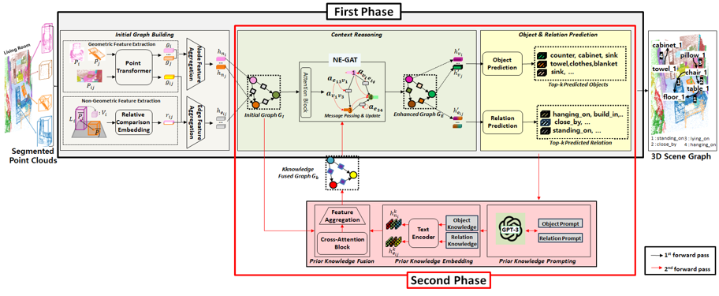
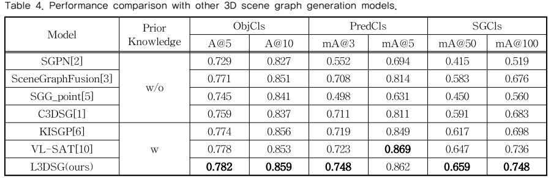
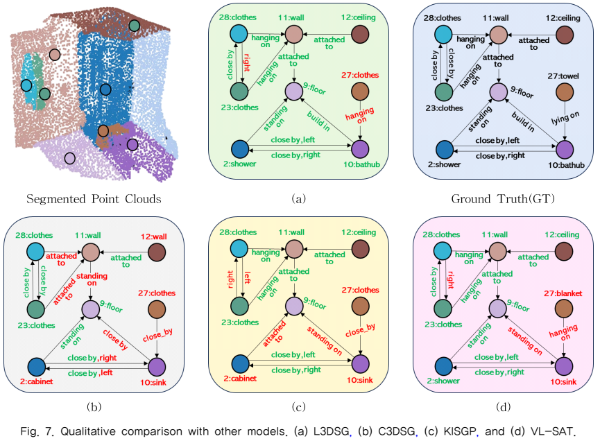

# L3DSG: 대규모 언어 모델(LLM)의 사전 지식을 활용한 3차원 장면 그래프 생성  
**L3DSG: 3D Scene Graph Generation using Prior Knowledge from Large Language Model(LLM)**

**석사 학위 논문, 2024**
- ###### [[Paper]](https://drive.google.com/file/d/196zuvJVMEIfqqRp0z1H7FOkmE792AZbH/view?usp=sharing)
- 
---

## Introduction

- 제안된 모델은 기존 **C3DSG**의 한계점인 실내 물리적 환경에 대한 **사전 지식**을 활용하지 못하는 문제를 해결하고자 합니다.
- 이를 위해 **대규모 언어 모델(LLM)을 활용하여 프롬프트를 통해 구체적인 사전 지식을 확보**하는 방법을 제안합니다.
- 또한, 확보된 사전 지식을 입력 포인트 클라우드의 **기하학적 특징과 융합**하여 3차원 장면 그래프 예측 정확도를 향상시키는 방법을 제안합니다.

---

## Dependencies

```bash
conda create -n csggn python=3.8
conda activate csggn
pip install -r requirements.txt
pip install torch==1.12.1+cu113 torchvision==0.13.1+cu113 torchaudio==0.12.1 --extra-index-url https://download.pytorch.org/whl/cu113
pip install torch-scatter -f https://pytorch-geometric.com/whl/torch-1.12.1+cu113.html
pip install torch-sparse -f https://pytorch-geometric.com/whl/torch-1.12.1+cu113.html
pip install torch-spline-conv -f https://pytorch-geometric.com/whl/torch-1.12.1+cu113.html
pip install torch-geometric
```

---

## Prepare

### 3RScan Dataset

1. **3RScan 다운로드**
   - [3RScan GitHub 링크](https://github.com/ShunChengWu/3DSSG)
   - 3RScan 이용 약관에 동의한 후, 다운로드 스크립트를 받아 3RScan 메인 디렉토리에 위치
   - 데이터 준비 실행:
     ```bash
     python scripts/RUN_prepare_dataset_3RScan.py --download --thread 8
     ```
   - 데이터 다운로드:
        ```bash
        python scripts/RUN_prepare_GT_setup_3RScan.py --thread 16
        ``` 
---

### Trained Models

- **사전-학습된 3D Visual Grounding 모델** 
  - [EDA](https://drive.google.com/file/d/1QrStRMAMlj5oD2Kh1yL5-faqBvQqCfGy/view?usp=sharing) `[root]/backbone_checkpoints/Lang3DVG/Lang~.pt`

- **사전-학습된 포인트 특징 추출기**
  - [PTv1](https://drive.google.com/file/d/1UgZrsZ-OI5w6ZAQ7l6lZdttu5M_ZYDs5/view?usp=sharing): `[root]/backbone_checkpoints/PTv1/PTV1_best_model.pth` 

- **최종 모델 가중치 (Epoch 300)**
  - [L3DSG](https://drive.google.com/drive/folders/1IGpl5Nmee4MI9ywAjB0TIFq9EgfUpo4a?usp=sharing): `[root]/config/ckp/L3DSGNet/`

---

## Run Code

### Train 
```bash
python main.py --mode train --config /[path]/config/L3DSGNet.json
```

### Evaluate 
```bash
python main.py --mode eval --config /[path]/config/L3DSGNet.json
```
---
## Result
### 정량적 평가
- 
### 정성적 평가
- 
---

## Paper

```bibtex
@article{백호준2023대규모,
  title={대규모 언어 모델 (LLM) 의 사전 지식을 활용한 3 차원 장면 그래프 생성},
  author={백호준 and 김인철},
  journal={멀티미디어학회논문지},
  volume={26},
  number={8},
  pages={859--873},
  year={2023}
}
```

---

## Acknowledgement

제안 모델은 [3DSSG](https://github.com/ShunChengWu/3DSSG), [PointTransformer](https://arxiv.org/abs/2012.09164), [EDA](https://arxiv.org/abs/2209.14941),[VL-SAT](https://github.com/wz7in/CVPR2023-VLSAT)의 일부 코드를 기반으로 구현되었습니다.
